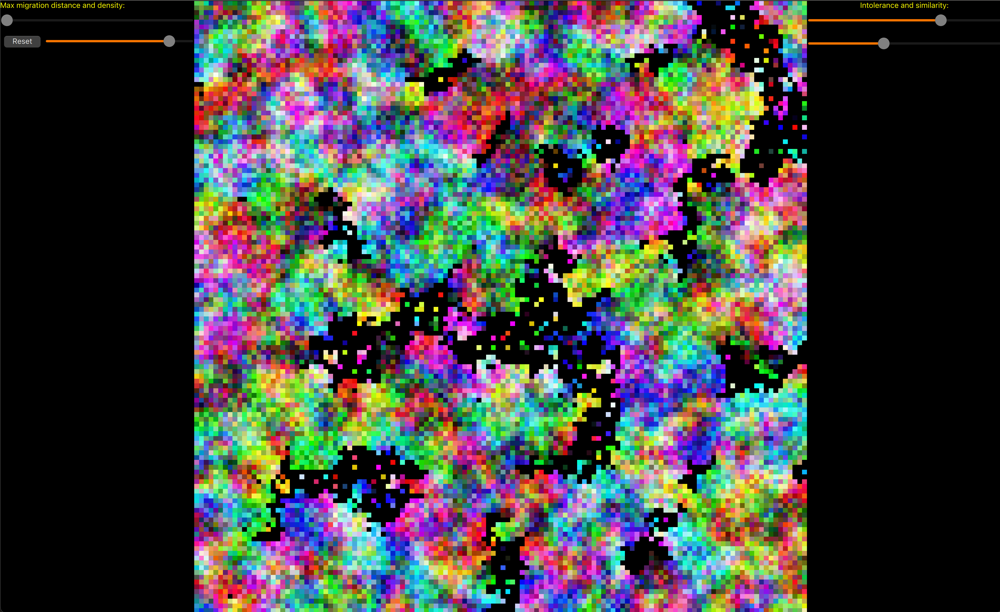

Implementation of [Schellings model of segregation](https://en.wikipedia.org/wiki/Schelling%27s_model_of_segregation).
However, I have not actually read the page, just glanced at it.

So that out of the way, whatever this is, it looks like:

